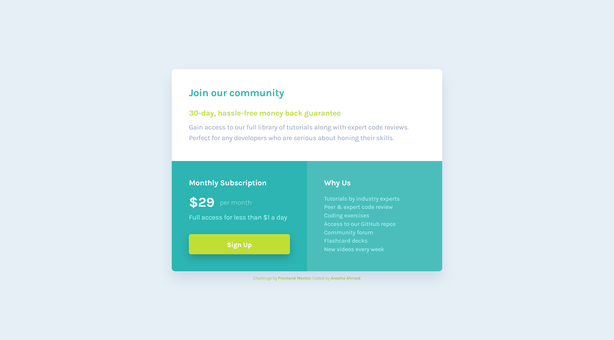

# Frontend Mentor - Single price grid component solution

This is a solution to the [Single price grid component challenge on Frontend Mentor](https://www.frontendmentor.io/challenges/single-price-grid-component-5ce41129d0ff452fec5abbbc).

## Table of contents

- [Overview](#overview)
  - [The challenge](#the-challenge)
  - [Screenshots](#screenshots)
  - [Links](#links)
- [My process](#my-process)
  - [Built with](#built-with)
  - [What I learned](#what-i-learned)
  - [Continued development](#continued-development)
- [Author](#author)

## Overview

### The challenge

Users should be able to:

- View the optimal layout for the component depending on their device's screen size
- See a hover state on desktop for the Sign Up call-to-action

### Screenshots

The desktop design VS My desktop solution 
 

 

The mobile design VS My mobile solution 
 

### Links

- Solution URL: [FrontEnd Mentor: My Solution](https://www.frontendmentor.io/solutions/single-price-grid-component-responsive-flexbox-mobilefirst-yKKYmCmGF)
- Live Site URL: [GitHub Page: Single Price Grid Component](https://anoshaahmed.github.io/fem08-single-price-component/)

## My process

### Built with

- Semantic HTML5 markup
- CSS custom properties
- Flexbox
- Mobile-first workflow

### What I learned

I struggle with `box-shadow` usually but today I think I finally understood its values a little.

### Continued development

I think I am good at flexbox now, so in the future I want to start using CSS Grid.

## Author

- Website - [Anosha Ahmed](https://www.anoshaahmed.com) - Not up at the moment, but will be soon.
- Frontend Mentor - [@anoshaahmed](https://www.frontendmentor.io/profile/anoshaahmed)
- Twitter - [@anosha1ahmed](https://www.twitter.com/anosha1ahmed)
